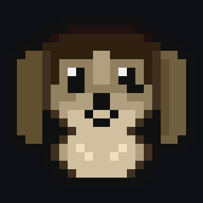
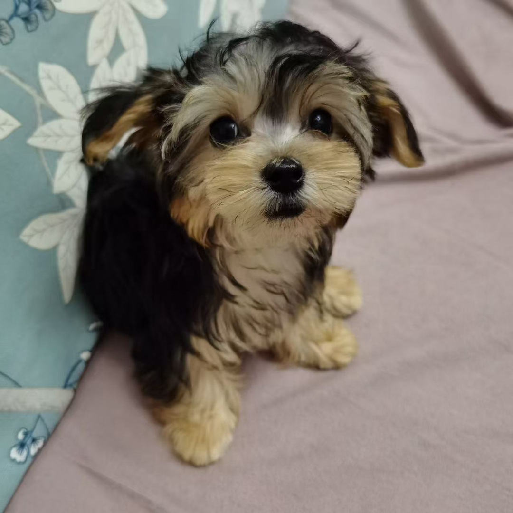

# Nibble · 住在编辑器里的像素小狗

[](https://open-vsx.org/extension/nibble/nibble)
[](https://open-vsx.org/extension/nibble/nibble)

一只像素小狗，住在 **CodeBuddy / VS Code** 的**状态栏**和**底部面板**里。
你每次向 AI 提问（或保存文件），它就**打一只怪**——升级、掉武器、收集图鉴，进度跨会话保存。

<p></p>

## 它是谁：我的狗「拾玖」

游戏里这只像素小狗，是照着我家的狗画的——**约克夏串串**，名字叫 **拾玖**。

<p></p>

把它的照片手工点成 24×24 像素（11 色），就成了游戏里的样子。它平时陪我写代码，现在也顺便帮你打工。

## 安装

**方式 1：装扩展（推荐，开箱可用）**

在 [Open VSX 市场](https://open-vsx.org/extension/nibble/nibble) 搜索 **Nibble** 安装，或命令面板执行
`Extensions: Install from VSIX...`。默认**保存文件即攻击**，不需要其他依赖。

**方式 2：再装本仓库的插件 → 提问即攻击（默认玩法）**

```text
/plugin marketplace add "<本仓库目录>"
/plugin install nibble@nibble-cb
/reload-plugins
/nibble:nibble-setup          # 把像素小狗写进状态栏
```

需要 **Node ≥ 16**；Windows 下 CodeBuddy 的 hooks 走 Git Bash，故需安装 [Git for Windows](https://git-scm.com/download/win)。

> 设置项：`nibble.triggerMode`（`hook` 提问即攻击 / `onSave` 保存即攻击 / `manual` 仅手动）、`nibble.statusBar`、`nibble.tickMs`。

## 怎么玩

| 你做什么 | 它做什么 |
|---|---|
| 提问 / 保存文件 | 攻击一次野生敌人 |
| 击败敌人 | 升级并**必掉 1 把武器**（普通 70% / 稀有 22% / 史诗 7% / 传说 1%，40 次保底） |
| 收集武器 | 80 把各有独立像素图 + 一段小故事；面板「🎒 武器库」按稀有度分组查看 |
| 挑一把带上 | 武器库详情卡点「装备此武器」，战斗页的装备槽就换成它（图鉴里有 ★ 标记） |

命令：`Nibble: 攻击一次`、`Nibble: 打开武器库`、`Nibble: 重置进度`。

## 隐私

**不读**你的代码、提示词、文件路径或文件内容。只在你**每天第一次打开编辑器**时发送 2 个字段——
**匿名 ID（本机随机生成）+ 版本号**；可在设置中一键关闭，上报失败一律静默忽略。

## 支持作者

如果这只小狗陪你写过几行代码，欢迎请拾玖吃根肉干 🦴

<p></p>

<sub>打赏纯属自愿。所有玩法（升级、武器库、收集）都是免费的，不影响任何功能。</sub>

## 更多

| 想看什么 | 去哪 |
|---|---|
| 怎么发版：改版本号 → 打 tag → CI 自动上架 | [`PUBLISHING.md`](PUBLISHING.md) |
| 玩法升级规划：武器库 / 装备 / 进化 / 收集设计 | [`docs/游戏升级规划/`](docs/游戏升级规划/) |
| 素材来源与版权（含拾玖照片的许可口径） | [`legacy-mods/CREDITS.md`](legacy-mods/CREDITS.md) |

设计灵感来自 [Spinlings](https://spinlings.dev/)（视觉语言与"随 AI 工作节奏推进"的交互思路）；本项目名称、代码与素材均为独立创作。
